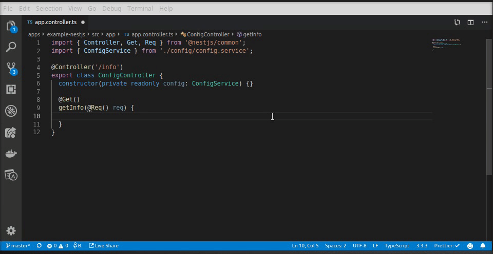

# NestJS webserver example

> The source-code for this example can be found here: `apps/example-nestjs/src/`

[NestJS](https://docs.nestjs.com/) is a framework for building efficient, scalable Node.js server-side applications. As it is fully written in TypeScript and provides an easy way to pass around a single instance of a class using dependecy injection, it is naturally a good match for the ts-configurable package. This example includes a NestJS webserver with a configuration service build with the ts-configurable package, a database connection module as well as a logging service.



## Get Started

The instructions on how to spin up a development environment can be found here: [Development Setup](../../CONTRIBUTING.md).

Starting the webserver:

```sh
$ npm run start example-nestjs
> AppController {/}:
> Mapped {/, GET} route
> Nest application successfully started
> Webserver listening at http://0.0.0.0:3000
```

Head over to: http://localhost:3000/ to see the final configuration object. You can now experiment with environment variables, command line arguments etc and observe how the configuration object is being modified.

## Configuration Service

The configuration service uses the `@Configurable()` decorator to make all configuration properties configurable. To avoid the configuration service being too big, the configuration class is split up into multiple configuration classes for each of the application's parts (web, logging, db). The configuration service class merges all of them together into one configurable class, which will be instantiated once and then injected using the dependecy injection provided by NestJS.

```ts
import { Configurable, BaseConfig } from '@ts-configurable';
import { Injectable } from '@nestjs/common';
import { WebConfig } from './web-config';
import { LoggingConfig } from '../logging/logging-config';
import { DatabaseConfig } from '../database/database-config';

@Injectable()
@Configurable()
/** Service providing configuration values */
export class ConfigService extends BaseConfig<ConfigService> {
  /** Webserver configuration */
  readonly web = new WebConfig();

  /** Logging configuration */
  readonly log = new LoggingConfig();

  /** Database configuration */
  readonly db = new DatabaseConfig();
}
```

## Database Connection

Most webservers have to establish a connection to a database. Therefore, this example includes a database module which uses the `@nestjs/typeorm` package to set up a connection to a local sqlite database file.

The database configuration is kept in a separate `DatabaseConfig` class containing all config options with their respective documentation.

```ts
// database-config.ts
import * as os from 'os';
import * as path from 'path';

/**
 * TypeORM database configuration:
 *  - https://github.com/typeorm/typeorm/blob/master/docs/connection-options.md
 */
export class DatabaseConfig {
  /** Database type. */
  readonly type = 'sqlite';

  /** Database name */
  readonly database = path.join(os.tmpdir(), 'database.sqlite');

  /** Entities to be loaded and used for this connection. Accepts both entity classes and directories paths to load from. Directories support glob patterns */
  readonly entities = [`${__dirname}/**/*.entity.ts`];

  /** Whether database schema should be auto created on every application launch */
  readonly synchronize = true;
}
```

We have to make use of dynamic modules as the database connection options are passed to the `TypeOrmModule` on import.

```ts
// database.module.ts
import { Module, DynamicModule } from '@nestjs/common';
import { TypeOrmModule } from '@nestjs/typeorm';
import { ConfigService } from '../config/config.service';

@Module({})
export class DatabaseModule {
  static forRoot(config: ConfigService): DynamicModule {
    return {
      imports: [TypeOrmModule.forRoot(config.db)],
      module: DatabaseModule,
    };
  }
}
```

The app module must also be dynamic to pass the config object to the database module. Note that we use the existing ConfigService instance inside the provider instead of creating a new one. This way, only one instance of the ConfigService class exists.

```ts
// app.module.ts
import { Module, DynamicModule } from '@nestjs/common';
import { ConfigController } from './config/config.controller';
import { LoggerService } from './logging/logger.service';
import { ConfigService } from './config/config.service';
import { DatabaseModule } from './database/database.module';

@Module({
  controllers: [ConfigController],
  providers: [LoggerService],
})
export class AppModule {
  static forRoot(config: ConfigService): DynamicModule {
    return {
      imports: [DatabaseModule.forRoot(config)],
      module: AppModule,
      providers: [
        {
          provide: ConfigService,
          useValue: config,
        },
      ],
    };
  }
}
```

We initialize the config instance ourselves so that we can pass it to the `forRoot` call of the app module.

```ts
// main.ts
import { NestFactory } from '@nestjs/core';
import { AppModule } from './app/app.module';
import { ConfigService } from './app/config/config.service';
import { LoggerService } from './app/logging/logger.service';

async function bootstrap() {
  // Instantiate config service
  const config = new ConfigService();

  const app = await NestFactory.create(AppModule.forRoot(config), {});

  // Set Nest logger to logging service
  const logger: LoggerService = app.get(LoggerService);
  app.useLogger(logger);

  // Start listening
  await app.listenAsync(config.web.port, config.web.host);
  logger.log(`Webserver listening at ${config.web.url}`);
}

bootstrap();
```

## Logging Service

Logging is another common task when setting up a webserver. As the logging service can access the configuration service using standard dependency injection, it is straight forward to access configuration values inside the logging service. The logging service has its own configuration class `LoggingConfig`, which encapsulates all logging-related configuration.

```ts
// logging-config.ts

/** Logging configuration */
export class LoggingConfig {
  /** Whether to suppress all logging output */
  readonly silent = false;

  /** Logging level: 1=info, 2=warning, 3=error */
  readonly level = 1;

  /** Log level constants */
  readonly LEVEL = {
    INFO: 1,
    WARN: 2,
    ERR: 3,
  };
}
```

```ts
// logger.service.ts
import { Injectable } from '@nestjs/common';
import { ConfigService } from '../config/config.service';
import { LoggerService as NestLoggerService } from '@nestjs/common';

@Injectable()
export class LoggerService implements NestLoggerService {
  constructor(private readonly config: ConfigService) {}

  log(message: any, context?: string): any {
    if (this.config.log.level <= this.config.log.LEVEL.INFO) {
      this.print(`> ${message}`);
    }
  }

  // [...]

  private print(message) {
    if (this.config.log.silent) {
      return;
    }
    console.log(message);
  }
}
```
